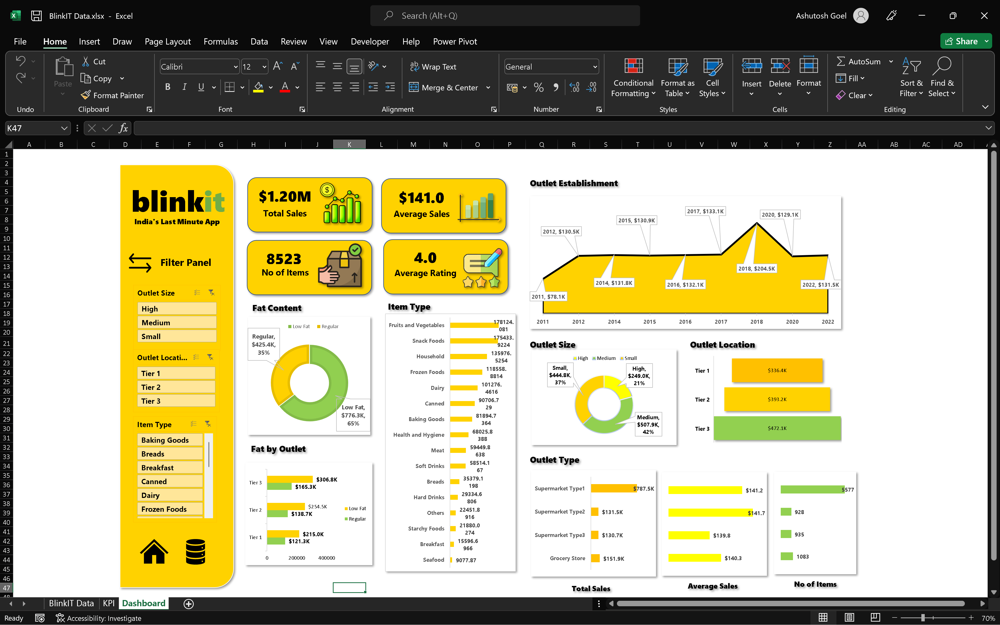

# Excel Analysis – Blinkit Sales Project

## Overview
This folder contains Microsoft Excel files used in the Blinkit Sales Analysis project.

Excel was used as an initial analysis and validation layer to explore the dataset, build pivot-based KPIs, and design an Excel dashboard before implementing scalable analysis in SQL, Python, and Power BI.

---

## Files in This Folder

BlinkIT Data.xlsx  
- Excel workbook containing raw data, pivot tables, and Excel-based dashboard

Dashboard.png  
- Screenshot preview of the Excel dashboard for quick viewing on GitHub

---

## Excel Dashboard Preview

---

## Excel Usage in the Project
Excel was used for:
- Initial data exploration and familiarization
- Understanding data structure and distributions
- Creating pivot tables for KPI analysis
- Designing an interactive Excel dashboard
- Performing quick sanity checks on totals and averages
- Cross-validating KPIs calculated using SQL and Python

---

## Analysis Performed
Using Excel features such as:
- Pivot Tables
- Filters and slicers
- Basic formulas (SUM, AVERAGE, COUNT)
- Conditional formatting
- Charts and visuals

The following metrics were analyzed:
- Total Sales
- Average Sales
- Number of Items
- Average Rating
- Sales by Item Type
- Sales by Outlet Size
- Sales by Outlet Location
- Sales trend by Outlet Establishment Year

---

## Role of Excel in the Workflow
Excel served as:
- The first analytical touchpoint
- A KPI validation tool
- A rapid dashboard prototyping layer

Insights derived in Excel were later:
- Automated using SQL
- Validated through Python EDA
- Finalized and visualized in Power BI

---

## Usage Guidelines
- Treat the Excel file as read-only
- Do not overwrite raw data
- Use it primarily for reference and validation

---

## Related Project Components
- Raw Data – Original CSV and source files
- SQL – Data cleaning, transformations, and KPI calculations
- Python – Exploratory data analysis and visualization
- Power BI – Interactive dashboard and reporting
