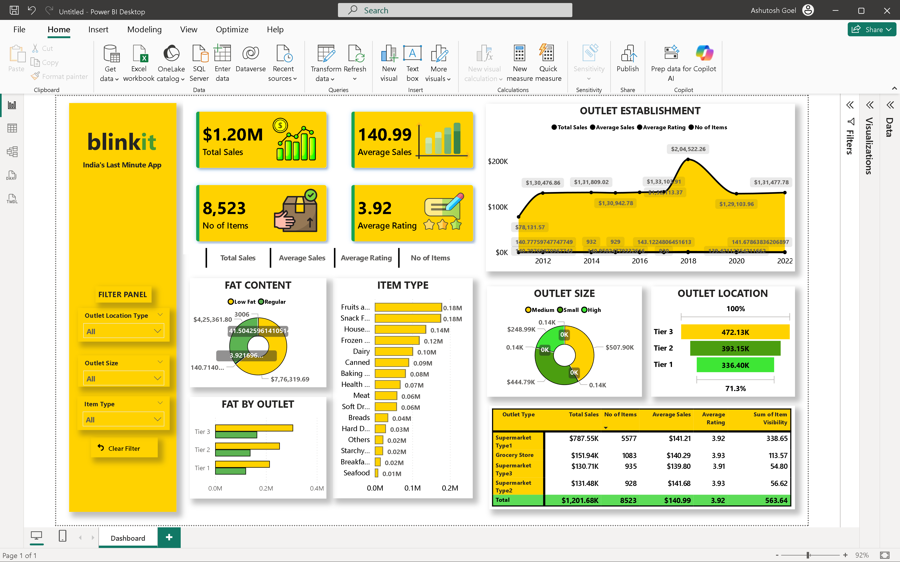

# Power BI Dashboard – Blinkit Sales Analysis

## Overview
This folder contains the Power BI dashboard created for the Blinkit Sales Analysis project.

Power BI is used as the final visualization and reporting layer, consolidating insights derived from Excel, SQL, and Python into an interactive business dashboard.

---

## Files in This Folder

BlinkIT_Analysis.pbix  
- Main Power BI dashboard file containing all visuals, DAX measures, and slicers

BlinkIT_Analysis.pbit  
- Power BI template file for reuse and scalability

BlinkIT_Analysis.pdf  
- Exported static version of the dashboard for documentation and sharing

Dashboard.png  
- Screenshot preview of the Power BI dashboard for quick viewing on GitHub

---

## Dashboard Preview

---

## Dashboard Objectives
The dashboard is designed to:
- Monitor overall sales and customer performance
- Track key KPIs at a glance
- Analyze outlet and product-level trends
- Enable interactive, filter-based analysis

---

## Key KPIs Displayed
- Total Sales
- Average Sales
- Number of Items
- Average Rating

These KPIs provide a high-level summary of business performance.

---

## Visualizations Included
- KPI cards for summary metrics
- Sales trend by Outlet Establishment Year
- Sales by Item Type
- Sales by Fat Content
- Sales distribution by Outlet Size
- Sales by Outlet Location
- Outlet Type performance comparison table

---

## Interactivity Features
Interactive slicers allow filtering by:
- Outlet Location Type
- Outlet Size
- Item Type

All visuals dynamically update based on user selections.

---

## Data Sources
The Power BI dashboard uses:
- Cleaned and transformed data from SQL queries
- Validated datasets cross-checked using Python
- Raw data originally sourced from CSV and Excel files

---

## Role of Power BI in the Project
Power BI served as:
- The final reporting and presentation layer
- A business-facing visualization tool
- A platform to unify insights from multiple data sources

---

## Usage Guidelines
- Open the `.pbix` file using Power BI Desktop
- Refresh data if required
- Use slicers to explore insights interactively

---

## Related Project Components
- Excel – Initial exploration and KPI validation
- SQL – Data cleaning, transformations, and KPI calculations
- Python – Exploratory data analysis and visualization

